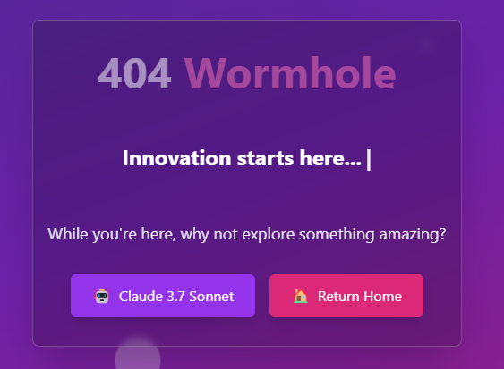

# aicanvas

A React application with React Router, bootstrapped with Vite, TypeScript, and Tailwind CSS.



## Getting Started

First, install the dependencies:

```bash
npm install
```

Then, run the development server:

```bash
npm run dev
```

Open [http://localhost:5173](http://localhost:5173) with your browser to see the result.

## Features

- React 18 with TypeScript
- React Router for navigation
- Vite for fast builds and development
- Tailwind CSS for styling
- Path aliases for clean imports
- Responsive design with dark mode support

## Project Structure

- `src/pages/`: Page components that correspond to routes
- `src/components/`: Reusable UI components
- `src/layouts/`: Layout components for page structure
- `src/lib/`: Utility functions and shared logic

## Learn More

- [React Router Documentation](https://reactrouter.com/)
- [Vite Documentation](https://vitejs.dev/)
- [React Documentation](https://react.dev/)
- [Tailwind CSS Documentation](https://tailwindcss.com/)
